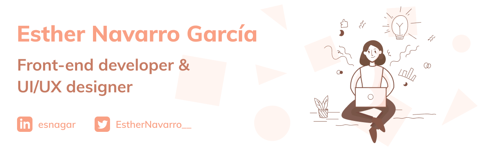

### 👋 Hi, I'm Esther! 

I'm a multimedia engineer interested in developing unique web and mobile apps. I'm specialized in front-end and 
UI/UX design, but I also enjoy working on everything related to databases and APIs. I am always aware 
of trends and best practices in order to develop quality products. **[Take a look to my CV](CV%20-%20Esther%20Navarro%20García.pdf)** to know more about me and my skills!

### 💌 Contact

Do you want to tell or ask me something? Let's talk!
* LinkedIn: [@Esnagar](https://www.linkedin.com/in/esnagar/)
* Twitter: [@EstherNavarro__](https://twitter.com/EstherNavarro__)
* E-mail: esther98ng@gmail.com

<!--
**Esnagar/Esnagar** is a ✨ _special_ ✨ repository because its `README.md` (this file) appears on your GitHub profile.

Here are some ideas to get you started:

- 🔭 I’m currently working on ...
- 🌱 I’m currently learning ...
- 👯 I’m looking to collaborate on ...
- 🤔 I’m looking for help with ...
- 💬 Ask me about ...
- 📫 How to reach me: ...
- 😄 Pronouns: ...
- ⚡ Fun fact: ...
-->
